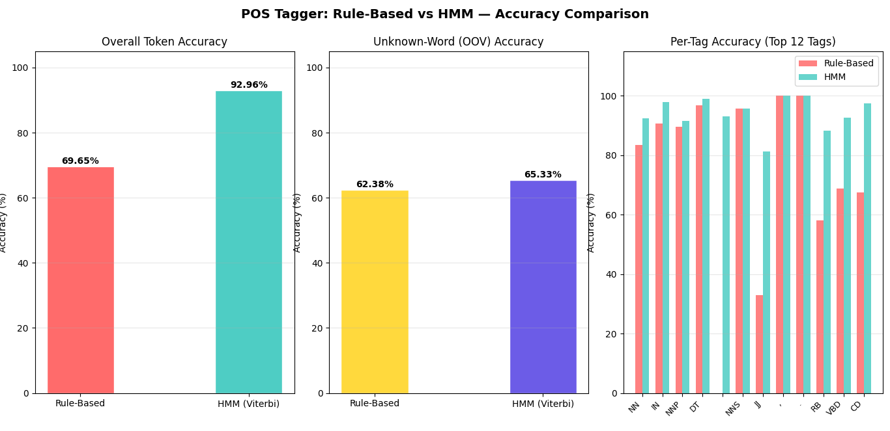
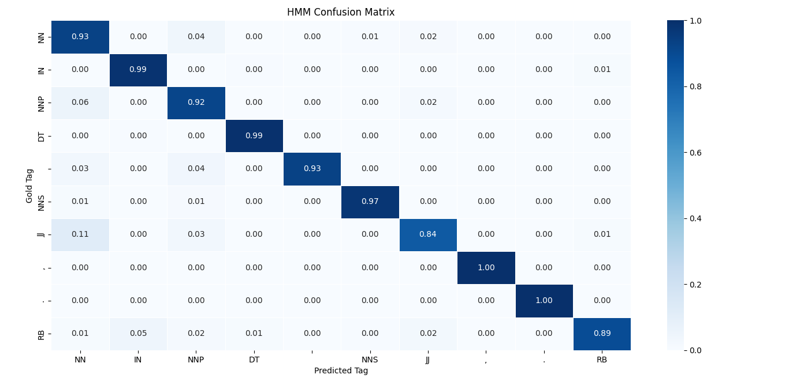
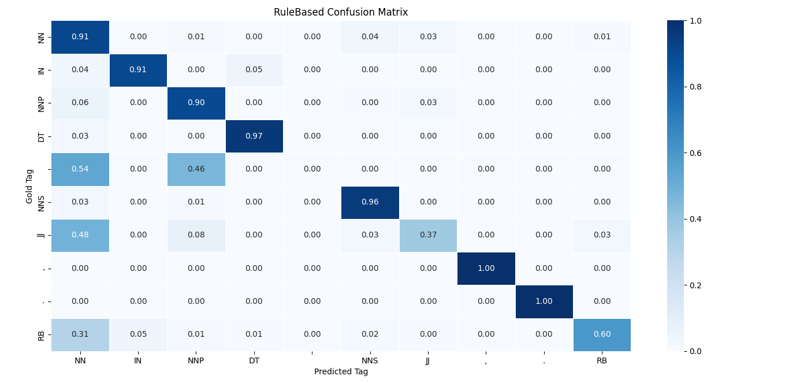

# 🚀 NLP POS Tagging: Rule-Based vs HMM

A complete implementation and comparison of **Rule-Based** and **Hidden Markov Model (HMM)** approaches for Part-of-Speech (POS) tagging using the Penn Treebank dataset.

---

## 📌 Overview

Part-of-Speech (POS) tagging assigns grammatical labels (NN, VB, JJ, etc.) to each word in a sentence. It is a core task in Natural Language Processing and a foundation for advanced applications like machine translation, chatbots, and information extraction.

This project builds both approaches from scratch and compares their performance.

---

## ⚙️ Tech Stack

* Python
* NLTK
* NumPy
* Matplotlib
* Seaborn

---

## 🚀 Features

✔ Rule-Based POS Tagger (lexical + suffix rules)
✔ HMM Bigram Tagger with Viterbi Algorithm
✔ Hybrid OOV (Unknown Word) Handling
✔ Accuracy Comparison & Evaluation
✔ Confusion Matrix & Visualizations

---

## 🧠 Key Innovation

Instead of assigning equal probability to unknown words, this project uses **rule-based suffix heuristics inside the HMM model**.

👉 This improves unknown word accuracy significantly.

---

## 📊 Results

| Model      | Accuracy |
| ---------- | -------- |
| Rule-Based | ~69%     |
| HMM        | ~93%     |

📈 HMM outperforms Rule-Based due to better context understanding.

---

## 📂 Dataset

* Penn Treebank (WSJ Corpus)
* Loaded via NLTK
* ~45 POS tags

---

## ⚙️ Installation

```bash
pip install nltk numpy matplotlib seaborn tabulate
python -c "import nltk; nltk.download('treebank')"
```

---

## ▶️ Run the Project

```bash
python nlp_updated.py
```

---

## 📊 Output

* Accuracy comparison charts
* Confusion matrices
* Tagged sentence outputs

---

## 📑 Project Presentation

📥 [Download PPT](./NLP_PPT_.pptx)

---

## 📸 Sample Output





---

## 📖 Concepts Covered

* POS Tagging
* Hidden Markov Models (HMM)
* Viterbi Algorithm
* Rule-Based NLP
* Sequence Labeling

---

## 💡 Conclusion

HMM significantly outperforms rule-based tagging due to its ability to learn from data and use context. The hybrid approach further improves performance on unseen words.

---

## ⭐ Future Improvements

* Add Neural Models (LSTM / BERT)
* Improve OOV handling further
* Deploy as a web app

---

## Author

Vishesh Jain
